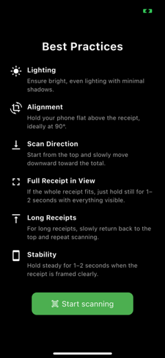
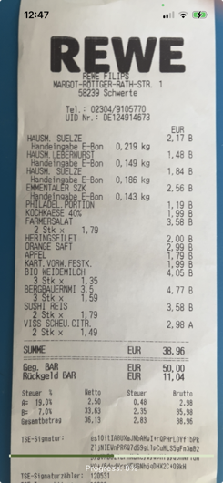
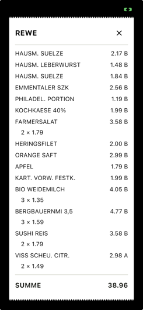

# 📷 receipt_recognition

[](https://pub.dev/packages/receipt_recognition)
[](https://pub.dev/packages/receipt_recognition/score)
[](https://pub.dev/packages/receipt_recognition)
[](LICENSE)
[](https://github.com/manfredbork/receipt_recognition/commits/main)

A Flutter package for scanning and extracting structured data from supermarket receipts using **Google's ML Kit**. Ideal
for building expense tracking apps, loyalty programs, or any system needing receipt parsing.

---

## ✨ Features

- 🧾 Detect and extract text from printed receipts
- 🛒 Optimized for typical supermarket layouts
- 🔍 Identifies line items, totals, and store names
- ⚡ Fast and efficient ML Kit text recognition
- 📱 Works on Android and iOS
- 🔧 Easy API with callback support
- 📐 Provides receipt bounds and estimated skew angle
- 🧠 Layered options (extend/override/tuning) to customize stores, labels, keywords, and optimizer thresholds
- 🧳 Stability-based merging and grouping to increase confidence over multiple scans
- 🗓️ Multi-format date parsing (numeric and EN/DE month-name formats)
- ⚖️ Detects and parses unit quantities and price-per-unit values (e.g., “2 × 1.29 €”)

---

## 🚀 Getting Started

### Installation

Add to your `pubspec.yaml`:

```yaml
dependencies:
  receipt_recognition: ^<latest_version>
```

Then run:

```bash
flutter pub get
```

### Platform Setup

✏️ Note: Camera-only scanning requires the camera permission. If your app also lets users pick images from the gallery,
add
the appropriate media/storage permission for your target SDK (Android) or Photo Library usage description (iOS).

#### Android

Update `AndroidManifest.xml`:

```xml
<uses-permission android:name="android.permission.CAMERA"/>
```

#### iOS

Update `Info.plist`:

```xml
<key>NSCameraUsageDescription</key>
<string>Camera access is needed to scan receipts.</string>
```

---

### 📦 Basic Usage

```dart
import 'package:flutter/material.dart';
import 'package:google_mlkit_text_recognition/google_mlkit_text_recognition.dart';
import 'package:receipt_recognition/receipt_recognition.dart';

/// Demo class showing receipt recognition API usage patterns.
///
/// This is a reference implementation for:
/// - Configuring receipt options with layered JSON
/// - Creating and using a receipt recognizer
/// - Processing images and handling scan callbacks
/// - Proper resource cleanup
class ReceiptApiDemo {
  /// Demonstrates receipt options configuration with layered approach.
  static final ReceiptOptions demoOptions = ReceiptOptions.fromLayeredJson({
    "extend": {
      "storeNames": {"REWE CITY": "Rewe"},
    },
    "override": {
      "stopKeywords": ["Rückgeld", "Change"],
    },
    "tuning": {
      "optimizerConfidenceThreshold": 88,
      "optimizerStabilityThreshold": 45,
    },
  });

  /// Creates a receipt recognizer with demo callbacks.
  static ReceiptRecognizer createDemoRecognizer() {
    return ReceiptRecognizer(
      options: demoOptions,
      onScanComplete: (receipt) {
        // Handle the recognized receipt
        debugPrint('Store: ${receipt.store?.value}');
        debugPrint('Total: ${receipt.total?.formattedValue}');
        for (final position in receipt.positions) {
          debugPrint(
            '${position.product.formattedValue}: ${position.price.formattedValue}',
          );
        }
      },
      onScanUpdate: (progress) {
        // Track scanning progress
        debugPrint(
          'Scan progress: ${progress.validationResult.matchPercentage}%',
        );
        debugPrint('Added positions: ${progress.addedPositions.length}');
      },
    );
  }

  /// Demonstrates image processing with a receipt recognizer.
  ///
  /// Receives ongoing snapshots from [processImage].
  /// A snapshot becomes final when [isValid] && [isConfirmed].
  /// [onScanComplete] fires at that point.
  static Future<void> demonstrateImageProcessing(
    ReceiptRecognizer recognizer,
    InputImage inputImage,
  ) async {
    final snapshot = await recognizer.processImage(inputImage);
    if (snapshot.isValid && snapshot.isConfirmed) {
      ReceiptLogger.logReceipt(snapshot);
    }
  }

  /// Demonstrates proper cleanup of recognizer resources.
  static void demonstrateCleanup(ReceiptRecognizer recognizer) {
    recognizer.close();
  }
}
```

### ⚙️ Options Overview

Use options to customize parsing, detection, and optimizer behavior. You can supply options as:

- Layered object: `extend`, `override`, and `tuning`
- Flat map: using a single-level JSON-like structure

Parameters (keys inside extend/override, or top-level in flat form)

- storeNames: Map<String, String>
    - Maps OCR labels to a canonical store name (case-insensitive detection).
- totalLabels: Map<String, String>
    - Maps variants (e.g., “SUMME”, “GESAMT”, “AMOUNT DUE”) to a canonical label.
- ignoreKeywords: List<String>
    - Lines containing any of these are ignored.
- stopKeywords: List<String>
    - Parsing stops after encountering these.
- allowedProductGroups: List<String>
    - Keywords that indicate allowed product categories during parsing.
- tuning: Map<String, dynamic> (override-only)
    - optimizerConfidenceThreshold (int): min combined confidence (0–100).
    - optimizerStabilityThreshold (int): min stability (0–100).
    - optimizerProductWeight (int): weight for product name stability when merging/updating; higher favors consistent
      names.
    - optimizerPriceWeight (int): weight for price consistency when merging/updating; higher favors matching prices.
    - optimizerMaxCacheSize (int): typical grouping capacity.
    - optimizerLoopThreshold (int): stall detection iterations.
    - optimizerAboveCountDecayThreshold (int): decay threshold for order counts.
    - optimizerVerticalTolerance (int): pixel tolerance for alignment.
    - optimizerTotalTolerance (double): amount tolerance when matching totals.
    - optimizerEwmaAlpha (double): smoothing for order learning.
    - optimizerUnrecognizedProductName (string) — the default name used when a product line cannot be confidently
      recognized.

⚠️ Note: Changing tuning parameters directly affects scan behavior and result quality; adjust them only if you know what
you’re doing. For most users, the defaults provide the best balance of accuracy, stability, and performance.

Merge behavior

- extend: merged with built-in defaults; user values win on duplicates.
- override: replaces the provided sections entirely; defaults ignored for those keys.
- tuning: always override-only (not merged); omitted fields fall back to defaults.

Examples

- Layered:

```dart
// Layered form:
// - extend merges with defaults (only provided keys; omitted sections use defaults)
// - override replaces the specified sections entirely
// - tuning overrides only the provided fields; others fall back to defaults
final layered = {
  "extend": {
    "storeNames": {
      "REWE CITY": "Rewe"
    }
  },
  "override": {
    "stopKeywords": ["Rückgeld", "Change"]
  },
  "tuning": {
    "optimizerConfidenceThreshold": 88,
    "optimizerStabilityThreshold": 45
  }
};

final options = ReceiptOptions.fromLayeredJson(layered);
```

- Flat:

```dart
// Flat form:
// - Provided sections override that section (no union merge for that section)
// - Omitted sections fall back to built-in defaults
// - tuning still overrides only provided fields (others use defaults)
final flat = {
  "storeNames": {
    "REWE": "Rewe",
    "REWE CITY": "Rewe"
  },
  "totalLabels": {
    "SUMME": "Summe",
    "GESAMT": "Gesamt"
  },
  "ignoreKeywords": ["E-Bon", "Coupon"],
  "stopKeywords": ["Rückgeld", "Change"],
  "tuning": {
    "optimizerConfidenceThreshold": 90 
  }
};

final options = ReceiptOptions.fromJsonLike(flat);
```

### 🎥 Advanced Example: Video Feed Integration

For an advanced use case, we provide an example of using this package with a video feed. You can integrate it with a
camera feed (via a package like `camera`), and continuously scan receipts in real time. Refer to the
**[example app](example/lib/main.dart)** for an implementation that uses live camera data to recognize and
process receipts as they appear in the frame.

|                                                                      Screenshots                                                                      |
|:-----------------------------------------------------------------------------------------------------------------------------------------------------:|
|    |

Single-shot scans are supported (singleScan = true), but we recommend the video-feed workflow for the best results.
Continuous frames allow stabilization and merging, which significantly improves recognition quality.

---

## 📚 Documentation

### Architecture Overview

The receipt_recognition package follows a modular architecture designed to handle the complexities of receipt scanning
and data extraction:

```
┌────────────────┐     ┌─────────────────┐     ┌────────────────┐
│                │     │                 │     │                │
│ Image Capture  │────▶│ Text Recognition│────▶│ Receipt Parser │
│                │     │                 │     │                │
└────────────────┘     └─────────────────┘     └────────┬───────┘
                                                        │
                                                        ▼
┌────────────────┐     ┌─────────────────┐     ┌────────────────┐
│                │     │                 │     │                │
│ Data Consumer  │◀────│ Data Optimizer  │◀────│ Data Extractor │
│                │     │                 │     │                │
└────────────────┘     └─────────────────┘     └────────────────┘
```

### Core Components

#### 1. ReceiptRecognizer

The main entry point for the package. It orchestrates the entire recognition process from image input to structured data
output.

#### 2. Text Recognition Engine

Leverages Google's ML Kit to perform OCR (Optical Character Recognition) on receipt images, converting the visual text
into digital text.

#### 3. ReceiptParser

Analyzes the raw text to identify and categorize receipt elements:

- Store name (e.g., Aldi, Rewe, Edeka, Penny, Lidl, Kaufland, Netto in German markets)
- Total ("Summe", "Gesamt", "Total")
- Line items (products and prices)
- Unit quantities and price-per-unit details (e.g., “2 × 1.29”)
- Total label normalization
- Purchase date extraction
- Receipt bounds and skew angle estimation

#### 4. ReceiptOptimizer

A crucial part that improves recognition accuracy through several mechanisms:

```
                        ┌───────────────────┐
                        │ ReceiptOptimizer  │
                        └─────────┬─────────┘
                                  │
                  ┌───────────────┼───────────────┐
                  │               │               │
      ┌───────────▼──────┐ ┌──────▼─────┐ ┌───────▼─────┐
      │ Group Management │ │Confidence  │ │Stability    │
      │                  │ │Calculation │ │Thresholds   │
      └──────────────────┘ └────────────┘ └─────────────┘
```

The optimizer:

- Groups similar receipt items together
- Applies confidence thresholds to filter out uncertain recognitions
- Uses stability measures to determine reliable data points
- Merges multiple scans for improved accuracy
- Stability-based grouping and merging across scans
- Vertical order learning (history/EWMA) for consistent line ordering
- Early outlier cleanup and regrouping when stalled

### Recognition Process

1. **Image Acquisition**: Capture receipt image from camera or gallery
2. **Text Detection**: ML Kit processes the image to extract raw text
3. **Structured Parsing**: A raw text is analyzed to identify receipt elements
4. **Optimization**: Multiple scans are compared and merged for accuracy
5. **Data Delivery**: Structured receipt data is returned directly; callbacks are optional for progress tracking

### Implementation Status

```
+-------------------------+----------------+--------------------------------+
| Feature                 | Status         | Notes                          |
+-------------------------+----------------+--------------------------------+
| Basic OCR               | ✅ Complete    | Using Google ML Kit            |
| Store Detection         | ✅ Complete    | With optimization + label norm |
| Total Sum Detection     | ✅ Complete    | With validation                |
| Line Item Recognition   | ✅ Complete    | Products with prices + merging |
| Receipt Merging         | ✅ Complete    | For improved accuracy          |
| Product Normalization   | ✅ Complete    | Standardizes product names     |
| Purchase Date Detection | ✅ Complete    | Parsed from multiple formats   |
| Bounds & Skew           | ✅ Complete    | Outer rect + skew estimation   |
| Unit Quantity & Price   | ✅ Complete    | Quantity and price-per-unit    |
+-------------------------+----------------+--------------------------------+
```

### Language Support

Currently, the package has optimized recognition for:

- **English receipts**: Supported for common layouts.
- **German receipts**: Full support with specialized detection patterns for:
    - German market chains (Aldi, Rewe, Edeka, etc.)
    - German total labels ("Summe", "Gesamt", "Zu zahlen")
    - German number formats (comma as decimal separator)

### Usage Patterns

The package supports two primary scanning approaches:

#### 1. Single-shot Recognition

Ideal for scanning from gallery images or single camera captures:

```
User selects image → OCR → Structure extraction → Data delivery
```

#### 2. Continuous Recognition (Video Feed)

Better for real-time scanning with a live preview:

```
┌────────────┐     ┌───────────┐     ┌────────────┐     ┌────────────┐
│  Camera    │────▶│ Frame     │────▶│ Recognition│────▶│ Confidence │
│  Stream    │     │ Capture   │     │ Process    │     │ Check      │
└────────────┘     └───────────┘     └────────────┘     └──────┬─────┘
                                                               │
┌────────────┐     ┌───────────┐     ┌────────────┐     ┌──────▼─────┐
│ Final      │◀────│ Automatic │◀────│ Preview    │◀────│ Feedback   │
│ Result     │     │ Confirm   │     │ Display    │     │ Loop       │
└────────────┘     └───────────┘     └────────────┘     └────────────┘
```

### Performance Considerations

- **Processing Time**: Typically 0.5–2 seconds per frame depending on a device
- **Memory Usage**: Peak usage of ~50–100MB during recognition
- **Battery Impact**: Moderate when using continuous scanning
- **Accuracy**: ~85–100% depending on receipt quality and lighting conditions

### Best Practices

1. **Lighting**: Ensure good, even lighting for the best OCR results
2. **Alignment**: Keep receipts as flat and aligned as possible
3. **Stability**: For continuous scanning, allow 1–2 seconds of stable framing
4. **Multiple Scans**: Use the optimizer's merging capabilities for improved accuracy
5. **Language Handling**: For mixed-language environments, consider setting the appropriate TextRecognitionScript when
   initializing the recognizer

### Receipt Validation and Manual Acceptance

The package includes a robust validation system that verifies receipt completeness based on the match between the
calculated total (from line items) and the detected total. Four validation states are possible:

```
+-------------------------+------------------------+-------------------------+
| Validation State        | Description            | Match Percentage        |
+-------------------------+------------------------+-------------------------+
| ReceiptCompleteness.    | Perfect match between  | 100%                    |
| complete                | line items and total   |                         |
+-------------------------+------------------------+-------------------------+
| ReceiptCompleteness.    | Very close match,      | default 95%             |
| nearlyComplete          | acceptable for most    | (configurable)          |
|                         | applications           |                         |
+-------------------------+------------------------+-------------------------+
| ReceiptCompleteness.    | Partial recognition    | <95%                    |
| incomplete              | with significant       |                         |
|                         | discrepancies          |                         |
+-------------------------+------------------------+-------------------------+
| ReceiptCompleteness.    | Missing critical data  | 0%                      |
| invalid                 | (e.g., total sum)      |                         |
+-------------------------+------------------------+-------------------------+
```

✏️ Note: You receive ongoing snapshots. A snapshot is final when it isValid && isConfirmed; onScanComplete is then
fired.

You can track the validation state through the `onScanUpdate` callback:

```dart
final receiptRecognizer = ReceiptRecognizer(
  onScanUpdate: (progress) {
    // Check validation status
    switch (progress.validationResult.status) {
      case ReceiptCompleteness.nearlyComplete:
        print('Receipt is ${progress.validationResult.matchPercentage}% complete');
        // Consider using acceptReceipt here if percentage is acceptable
        break;
      case ReceiptCompleteness.incomplete:
        print('Still scanning...');
        break;
      // Handle other cases
    }
  },
);
```

#### Manual Receipt Acceptance

When automatic validation doesn't reach 100% match but the receipt seems adequate, you can manually accept it using the
`acceptReceipt` method:

```dart
// Example: Accepting a nearly complete receipt when user taps "Accept"
void acceptCurrentReceipt() {
  if (progress.validationResult.matchPercentage >= 95) {
    final acceptedReceipt = receiptRecognizer.acceptReceipt(progress.mergedReceipt);
    // Handle the accepted receipt
  }
}
```

#### Receipt Validation Flow

```
                         ┌───────────────┐
                         │    Scan       │
                         │   Receipt     │
                         └───────┬───────┘
                                 │
                                 ▼
┌─────────────────┐      ┌───────────────┐      ┌─────────────────┐
│                 │      │  Validation   │      │                 │
│  Invalid (0%)   │◀─────┤   Process     ├─────▶│  Complete (100%)│
│                 │      │               │      │                 │
└─────────────────┘      └───────┬───────┘      └────────┬────────┘
                                 │                       │
                                 │                       │
                                 ▼                       ▼
              ┌─────────────────────────┐       ┌──────────────────┐
              │                         │       │                  │
              │  Incomplete (<95%)      │       │ Auto-accepted    │
              │                         │       │                  │
              └──────────┬──────────────┘       └──────────────────┘
                         │
                         │
                         ▼
              ┌─────────────────────────┐
              │                         │
              │  Nearly Complete (≥95%) │
              │                         │
              └──────────┬──────────────┘
                         │
                         │
                         ▼
              ┌─────────────────────────┐
              │                         │
              │  Manual Acceptance      │
              │  acceptReceipt()        │
              │                         │
              └─────────────────────────┘
```

This workflow enables you to build UIs that show the user scanning progress and offer manual acceptance for receipts
that don't achieve perfect validation but are still usable.

## 📦 Release Notes

See the [CHANGELOG.md](CHANGELOG.md) for a complete list of updates and version history.

---

## 🔮 Roadmap

- [x] Product name normalization
- [x] Long receipt support and merging mechanism
- [x] Multi-language receipt support
- [x] Purchase date detection
- [x] Total label normalization
- [x] Bounds and skew estimation
- [x] Layered options (extend/override/tuning)
- [x] Stability-based grouping/merging
- [x] Extended OCR correction (single-character replacement/removal for common OCR errors)
- [x] Unit recognition with price-per-unit parsing and quantity extraction
- [ ] Enhanced Android platform integration
- [ ] Broader international receipt layout support

---

## 🤝 Contributing

Contributions, suggestions, and bug reports are welcome! Feel free to open an issue or PR.

---

## 📄 License

This package is released under the [MIT License](LICENSE).
