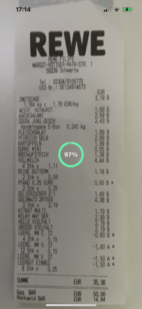

# 📷 receipt_recognition

[](https://pub.dev/packages/receipt_recognition)
[](https://pub.dev/packages/receipt_recognition/score)
[](https://pub.dev/packages/receipt_recognition)
[](LICENSE)
[](https://github.com/manfredbork/receipt_recognition/commits/main)

A Flutter package for scanning and extracting structured data from supermarket receipts using **Google's ML Kit**. Ideal for building expense tracking apps, loyalty programs, or any system needing receipt parsing.

---

## ✨ Features

- 🧾 Detect and extract text from printed receipts
- 🛒 Optimized for typical supermarket layouts
- 🔍 Identifies line items, totals, and store names
- ⚡ Fast and efficient ML Kit text recognition
- 📱 Works on Android and iOS
- 🔧 Easy API with callback support

---

## 🚀 Getting Started

### Installation

Add to your `pubspec.yaml`:

```yaml
dependencies:
  receipt_recognition: ^<latest_version>
```

Then run:

```bash
flutter pub get
```

### Platform Setup

#### Android

Update `AndroidManifest.xml`:

```xml
<uses-permission android:name="android.permission.CAMERA"/>
<uses-permission android:name="android.permission.READ_EXTERNAL_STORAGE"/>
```

#### iOS

Update `Info.plist`:

```xml
<key>NSCameraUsageDescription</key>
<string>Camera access is needed to scan receipts.</string>
<key>NSPhotoLibraryUsageDescription</key>
<string>Photo library access is needed to select receipt images.</string>
```

---

### 📦 Basic Usage

```dart
import 'package:flutter/material.dart';
import 'package:receipt_recognition/receipt_recognition.dart';
import 'package:google_mlkit_text_recognition/google_mlkit_text_recognition.dart';

// Create a receipt recognizer
final receiptRecognizer = ReceiptRecognizer(
  singleScan: true,
  onScanComplete: (receipt) {
    // Handle the recognized receipt
    print('Company: ${receipt.company?.value}');
    print('Total: ${receipt.sum?.formattedValue}');
    
    for (final position in receipt.positions) {
      print('${position.product.formattedValue}: ${position.price.formattedValue}');
    }
  },
  onScanUpdate: (progress) {
    // Track scanning progress
    print('Scan progress: ${progress.estimatedPercentage}%');
    print('Added positions: ${progress.addedPositions.length}');
  },
);

// Process an image
Future<void> processReceiptImage(InputImage inputImage) async {
  final receipt = await receiptRecognizer.processImage(inputImage);
  if (receipt != null) {
    // Receipt was successfully recognized
  }
}

// Don't forget to close the receipt recognizer when done
@override
void dispose() {
  receiptRecognizer.close();
  super.dispose();
}
```

### 🎥 Advanced Example: Video Feed Integration

For an advanced use case, we provide an example of using this package with a video feed. You can integrate it with a camera feed (via a package like `camera`), and continuously scan receipts in real time.

<p style="width:100vh">
  
  
  
</p>

Refer to the **[example app](example/lib/main.dart)** for an implementation that uses live camera data to recognize and process receipts as they appear in the frame.

---

## 📚 Documentation

### Architecture Overview

The receipt_recognition package follows a modular architecture designed to handle the complexities of receipt scanning and data extraction:

```
┌────────────────┐     ┌─────────────────┐     ┌────────────────┐
│                │     │                 │     │                │
│ Image Capture  │────▶│ Text Recognition│────▶│ Receipt Parser │
│                │     │                 │     │                │
└────────────────┘     └─────────────────┘     └────────┬───────┘
                                                        │
                                                        ▼
┌────────────────┐     ┌─────────────────┐     ┌────────────────┐
│                │     │                 │     │                │
│ Data Consumer  │◀────│ Data Optimizer  │◀────│ Data Extractor │
│                │     │                 │     │                │
└────────────────┘     └─────────────────┘     └────────────────┘
```

### Core Components

#### 1. ReceiptRecognizer

The main entry point for the package. It orchestrates the entire recognition process from image input to structured data output.

#### 2. Text Recognition Engine

Leverages Google's ML Kit to perform OCR (Optical Character Recognition) on receipt images, converting the visual text into digital text.

#### 3. ReceiptParser

Analyzes the raw text to identify and categorize receipt elements:
- Store/company name (e.g., Aldi, Rewe, Edeka, Penny, Lidl, Kaufland, Netto in German markets)
- Total sum ("Summe", "Gesamt", "Total")
- Line items (products and prices)
- Date and time information

#### 4. ReceiptOptimizer

A crucial part that improves recognition accuracy through several mechanisms:

```
                        ┌───────────────────┐
                        │ ReceiptOptimizer  │
                        └─────────┬─────────┘
                                  │
                  ┌───────────────┼───────────────┐
                  │               │               │
      ┌───────────▼──────┐ ┌──────▼─────┐ ┌───────▼─────┐
      │ Group Management │ │Confidence  │ │Stability    │
      │                  │ │Calculation │ │Thresholds   │
      └──────────────────┘ └────────────┘ └─────────────┘
```

The optimizer:
- Groups similar receipt items together
- Applies confidence thresholds to filter out uncertain recognitions
- Uses stability measures to determine reliable data points
- Merges multiple scans for improved accuracy

### Recognition Process

1. **Image Acquisition**: Capture receipt image from camera or gallery
2. **Text Detection**: ML Kit processes the image to extract raw text
3. **Structured Parsing**: A raw text is analyzed to identify receipt elements
4. **Optimization**: Multiple scans are compared and merged for accuracy
5. **Data Delivery**: Structured receipt data is provided via callbacks

### Implementation Status

```
+-------------------------+----------------+--------------------------------+
| Feature                 | Status         | Notes                          |
+-------------------------+----------------+--------------------------------+
| Basic OCR               | ✅ Complete    | Using Google ML Kit            |
| Company/Store Detection | ✅ Complete    | With optimization              |
| Total Sum Detection     | ✅ Complete    | With validation                |
| Line Item Recognition   | ✅ Complete    | Products with prices           |
| Receipt Merging         | ✅ Complete    | For improved accuracy          |
| Product Normalization   | ✅ Complete    | Standardizes product names     |
| Multi-language Support  | ⚠️ Partial     | Focus on English and German    |
| Original Item Ordering  | ❌ Planned     | Preserving receipt line order  |
| TSE Detection           | 🔄 In Progress | Coming soon                    |
| Tax/Discount Detection  | 🔄 In Progress | Coming soon                    |
+-------------------------+----------------+--------------------------------+
```

### Language Support

Currently, the package has optimized recognition for:

- **English receipts**: Full support for standard formats
- **German receipts**: Full support with specialized detection patterns for:
  - German market chains (Aldi, Rewe, Edeka, etc.)
  - German sum labels ("Summe", "Gesamt", "Zu zahlen")
  - German number formats (comma as decimal separator)

### Usage Patterns

The package supports two primary scanning approaches:

#### 1. Single-shot Recognition

Ideal for scanning from gallery images or single camera captures:

```
User selects image → OCR → Structure extraction → Data callback
```

#### 2. Continuous Recognition (Video Feed)

Better for real-time scanning with a live preview:

```
┌────────────┐     ┌───────────┐     ┌────────────┐     ┌────────────┐
│  Camera    │────▶│ Frame     │────▶│ Recognition│────▶│ Confidence │
│  Stream    │     │ Capture   │     │ Process    │     │ Check      │
└────────────┘     └───────────┘     └────────────┘     └──────┬─────┘
                                                               │
┌────────────┐     ┌───────────┐     ┌────────────┐     ┌──────▼─────┐
│ Final      │◀────│ User      │◀────│ Preview    │◀────│ Feedback   │
│ Result     │     │ Confirm   │     │ Display    │     │ Loop       │
└────────────┘     └───────────┘     └────────────┘     └────────────┘
```

### Performance Considerations

- **Processing Time**: Typically 0.5–2 seconds per frame depending on a device
- **Memory Usage**: Peak usage of ~50–100MB during recognition
- **Battery Impact**: Moderate when using continuous scanning
- **Accuracy**: ~85–95% depending on receipt quality and lighting conditions

### Best Practices

1. **Lighting**: Ensure good, even lighting for the best OCR results
2. **Alignment**: Keep receipts as flat and aligned as possible
3. **Stability**: For continuous scanning, allow 1–2 seconds of stable framing
4. **Multiple Scans**: Use the optimizer's merging capabilities for improved accuracy
5. **Language Handling**: For mixed-language environments, consider setting the appropriate TextRecognitionScript when initializing the recognizer

### Receipt Validation and Manual Acceptance

The package includes a robust validation system that verifies receipt completeness based on the match between calculated sum (from line items) and the detected total sum. Four validation states are possible:

```
+-------------------------+------------------------+-------------------------+
| Validation State        | Description            | Match Percentage        |
+-------------------------+------------------------+-------------------------+
| ReceiptCompleteness.    | Perfect match between  | 100%                    |
| complete                | line items and total   |                         |
+-------------------------+------------------------+-------------------------+
| ReceiptCompleteness.    | Very close match,      | 95-99%                  |
| nearlyComplete          | acceptable for most    | (configurable)          |
|                         | applications           |                         |
+-------------------------+------------------------+-------------------------+
| ReceiptCompleteness.    | Partial recognition    | <95%                    |
| incomplete              | with significant       |                         |
|                         | discrepancies          |                         |
+-------------------------+------------------------+-------------------------+
| ReceiptCompleteness.    | Missing critical data  | 0%                      |
| invalid                 | (e.g., total sum)      |                         |
+-------------------------+------------------------+-------------------------+
```

You can track the validation state through the `onScanUpdate` callback:

```dart
final receiptRecognizer = ReceiptRecognizer(
  onScanUpdate: (progress) {
    // Check validation status
    switch (progress.validationResult.status) {
      case ReceiptCompleteness.nearlyComplete:
        print('Receipt is ${progress.validationResult.matchPercentage}% complete');
        // Consider using acceptReceipt here if percentage is acceptable
        break;
      case ReceiptCompleteness.incomplete:
        print('Still scanning...');
        break;
      // Handle other cases
    }
  },
);
```

#### Manual Receipt Acceptance

When automatic validation doesn't reach 100% match but the receipt seems adequate, you can manually accept it using the `acceptReceipt` method:

```dart
// Example: Accepting a nearly complete receipt when user taps "Accept"
void acceptCurrentReceipt() {
  if (progress.mergedReceipt != null && 
      progress.validationResult.matchPercentage! >= 95) {
    final acceptedReceipt = receiptRecognizer.acceptReceipt(progress.mergedReceipt!);
    // Handle the accepted receipt
  }
}
```

#### Receipt Validation Flow

```
                         ┌───────────────┐
                         │    Scan       │
                         │   Receipt     │
                         └───────┬───────┘
                                 │
                                 ▼
┌─────────────────┐      ┌───────────────┐      ┌─────────────────┐
│                 │      │  Validation   │      │                 │
│  Invalid (0%)   │◀─────┤   Process     ├─────▶│  Complete (100%)│
│                 │      │               │      │                 │
└─────────────────┘      └───────┬───────┘      └────────┬────────┘
                                 │                       │
                                 │                       │
                                 ▼                       ▼
              ┌─────────────────────────┐       ┌──────────────────┐
              │                         │       │                  │
              │  Incomplete (<95%)      │       │ Auto-accepted    │
              │                         │       │                  │
              └──────────┬──────────────┘       └──────────────────┘
                         │
                         │
                         ▼
              ┌─────────────────────────┐
              │                         │
              │  Nearly Complete (≥95%) │
              │                         │
              └──────────┬──────────────┘
                         │
                         │
                         ▼
              ┌─────────────────────────┐
              │                         │
              │  Manual Acceptance      │
              │  acceptReceipt()        │
              │                         │
              └─────────────────────────┘
```

This workflow enables you to build UIs that show the user scanning progress and offer manual acceptance for receipts that don't achieve perfect validation but are still usable.

### Upcoming: Spatial Position-Based Item Ordering

A key upcoming feature is the preservation of original item ordering from receipts across multiple scans. The planned algorithm will:

```
┌─────────────────┐     ┌──────────────────┐     ┌───────────────────┐
│ Vertical        │     │ Confidence-Based │     │ Consistent        │
│ Position Mapping│────▶│ Order Resolution │────▶│ Order Preservation│
└─────────────────┘     └──────────────────┘     └───────────────────┘
```

1. **Y-coordinate tracking**: Record precise vertical positions of items during OCR
2. **Spatial relationship graph**: Build a directed graph representing item positions
3. **Topological sorting**: Determine optimal ordering that preserves receipt structure
4. **Confidence weighting**: Prioritize positions with higher recognition confidence
5. **Order stabilization**: Maintain consistent ordering across multiple scans

This enhancement will significantly improve the usability for expense tracking and financial applications that require precise item order preservation.

---

## 📦 Release Notes

See the [CHANGELOG.md](CHANGELOG.md) for a complete list of updates and version history.

---

## 🔮 Roadmap

- [x] Product name normalization
- [x] Long receipt support and merging mechanism
- [x] Multi-language receipt support (English and German)
- [ ] Original item ordering preservation
- [ ] TSE detection and categorization
- [ ] Tax and discount detection
- [ ] Smart OCR region selection
- [ ] Additional language support (French, Spanish, Italian)

---

## 🤝 Contributing

Contributions, suggestions, and bug reports are welcome! Feel free to open an issue or PR.

---

## 📄 License

This package is released under the [MIT License](LICENSE).
